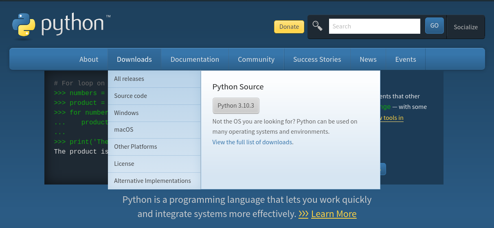
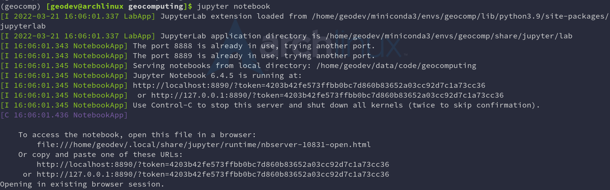
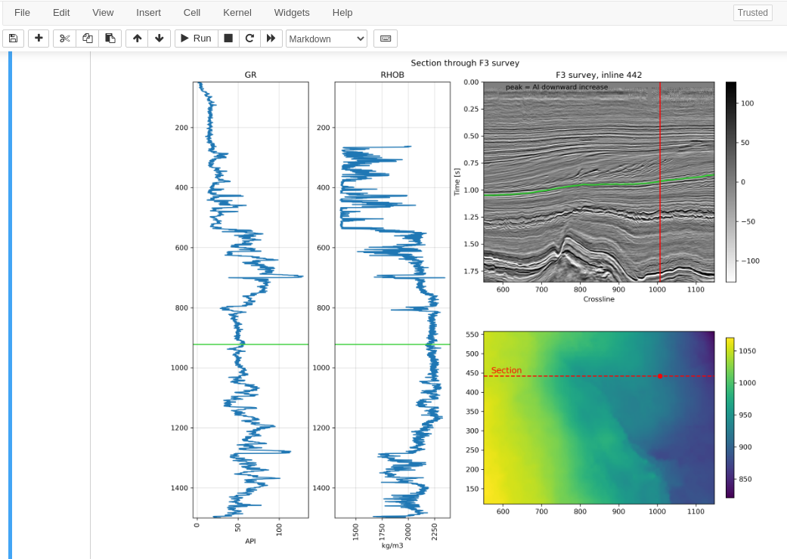

# Installation and Setup

<!-- .slide: data-background="./images/Agile_logo.png" -->

---

## Getting python installed on your computer

----

### python.org

Note: Navigate to python.org, select the Download option, and then choose the option that's right for your Operating System (OS)

----

### Miniconda

> Miniconda is a free minimal installer for conda. It [...] includes only conda, Python, the packages they depend on, and a small number of other useful packages [...].

1. Click the 64-bit Python 3.9 version download link.
2. Run the installer, accepting the license.
3. Accept the defaults.

[Miniconda Installer Links](https://docs.conda.io/en/latest/miniconda.html#latest-miniconda-installer-links)

----

### Anaconda

> Your data science toolkit
[...] the open-source Individual Edition (Distribution) is the easiest way to perform Python/R data science and machine learning on a single machine.

[Anaconda Individual Edition](https://www.anaconda.com/products/individual)

Note: [Anaconda or miniconda](https://docs.conda.io/projects/conda/en/latest/user-guide/install/download.html#anaconda-or-miniconda)

Choose Anaconda if you:
- Are new to conda or Python.
- Like the convenience of having Python and over 1,500 scientific packages automatically installed at once.
- Have the time and disk space---a few minutes and 3 GB.
- Do not want to individually install each of the packages you want to use.
- Wish to use a set of packages curated and vetted for interoperability and usability.
- But beware, for enterprise editions, see [pricing](https://www.anaconda.com/pricing)

Choose Miniconda if you:
- Do not mind installing each of the packages you want to use individually.
- Do not have time or disk space to install over 1,500 packages at once.
- Want fast access to Python and the conda commands and you wish to sort out the other programs later.

----

### A Note on different operating systems

Python is **platform independant**, you can install it on Windows, Mac or GNU/Linux. There are even versions of python for [other platforms](https://www.python.org/download/other/).

---

## Creating a coding environment

Writing code is an exercise in dependency management, and ideally, you want to *delegate* that task to an environment manager. That is, a program that will check through all the installed packages (tools) you've installed and make sure all the versions are compatible.

----

### conda, pyenv, virtualenv

We'll use [`conda`](https://conda.io/projects/conda/en/latest/user-guide/tasks/manage-environments.html) in this tutorial but here is a nice [Stack Overflow](https://stackoverflow.com/questions/38217545/what-is-the-difference-between-pyenv-virtualenv-anaconda) discussion of the options at your disposal.

----

### Setting up an environment (1/2)

1. Click on this link and leave the file in your Downloads folder:
[T22_getting_started/environment.yml](https://github.com/Zabamund/T22_getting_started/blob/master/environment.yml)

2. Open an Anaconda Prompt from the Start menu, and type the following (all one line!):

`conda env create -f %USERPROFILE%/Downloads/environment.yml`

Note: For Mac and Linux users, simply save the `environment.yml` file in your Downloads folder, navigate to that folder in your terminal emulator and run `conda env create` (it will use `environment.yml` by default).

----

### Setting up an environment (2/2)

3. Hit return if it asks for confirmation. When finished, start the environment:

`conda activate t22_setup`

4. Now one more step to get access to this environment from inside Jupyter (all one line again!):

`python -m ipykernel install --user --name t22_setup`

----

### jupyter

To start coding, run:

`jupyter notebook`

This will start a server and launch the notebook in your default browser:

Note: Simply show whichever notebook instance I have running during demo.

----

### Basic geoscience tool set

Let's open

`environment.yml`

to see what we installed.

Note: Open `./environment.yml` inside the jupyter notebook.

---

## Choosing a text editor

To write code, well, you're going to need to _write_ code! And because Python can be quite particular about formatting, you'll need a decent text editor.

----

### Jupyter

The [jupyter project](https://jupyter.org/) provides the `jupyter notebook` environment:

Note: We'll see this soon, but in here we can write formatted text, code, and have code outputs.

----

### VSCode, Atom, Sublime Text

- [vscode](https://code.visualstudio.com/): Code editing.
Redefined.
- [vscodium](https://vscodium.com/): Open Source Binaries of VS Code
- [Atom](https://atom.io/): A hackable text editor for the 21st Century
- [Sublime Text](https://www.sublimetext.com/): Text Editing, Done Right (but not free)

Note: It doesn't matter which you choose, as long as it works for you!

----

### vi, vim, nano, emacs

The old school approach, but still totally valid:

- [vi](http://ex-vi.sourceforge.net/)
- [vim](https://www.vim.org/)
- [nano](https://www.nano-editor.org/)
- [emacs](https://www.gnu.org/software/emacs/)

Note: It doesn't matter which you choose, as long as it works for you!

---

## Running python

Python is a program installed on your computer, and it can be used in different ways, e.g.:
- executing python code in an interactive session
- running a python script directly from the operating system
- in a Jupyter notebook, Binder instance, Google Collab, etc.

Note: we run python from the command-line interface (CLI) either
- (1) as a simple code editor for example to quickly check out a python feature or
- (2) as a script runner where we invoke python from the CLI but pass a python script to it to execute or
- (3) in a notebook-like environment

---

## NEXT: intro to python notebook!
